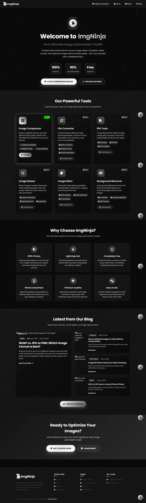

# ImgNinja 🥷

[](https://opensource.org/licenses/MIT)
[](https://developer.mozilla.org/en-US/docs/Web/HTML)
[](https://developer.mozilla.org/en-US/docs/Web/CSS)
[](https://developer.mozilla.org/en-US/docs/Web/JavaScript)

**Modern image compression tool with privacy-first approach**

ImgNinja is a powerful, free online image optimization toolkit that works entirely in your browser. Compress, resize, and optimize images without losing quality - all while maintaining complete privacy and security.



## ✨ Features

### 🖼️ **Multi-Format Support**
- **JPG/JPEG** - Lossy compression with quality control
- **PNG** - Lossless compression with transparency support
- **WEBP** - Modern format with superior compression
- **GIF** - Animated and static GIF optimization
- **HEIF/HEIC** - Apple's modern image format
- **ICO** - Icon file compression
- **SVG** - Vector graphics optimization

### 🔒 **Privacy-First Design**
- **100% Client-Side Processing** - Images never leave your device
- **No Server Uploads** - All compression happens in your browser
- **Complete Privacy** - No data collection or tracking
- **Secure Processing** - Your images remain private

### ⚡ **Advanced Features**
- **Real-time Preview** - See results before downloading
- **Quality Control** - Adjustable compression levels
- **Batch Processing** - Multiple images at once
- **Size Targeting** - Compress to specific file sizes
- **Dimension Control** - Resize images while compressing
- **Format Conversion** - Convert between different formats
- **Branded Downloads** - Files saved with `imgninja_compressed_` prefix

### 🎨 **Modern UI/UX**
- **Responsive Design** - Works on desktop, tablet, and mobile
- **Animated Hero Section** - Modern logo with particle effects
- **Dark Theme** - Easy on the eyes
- **Intuitive Interface** - Simple drag-and-drop functionality
- **Progress Indicators** - Real-time compression feedback

### 📝 **Integrated Blog**
- **Expert Tips** - Image optimization tutorials
- **Best Practices** - SEO and performance guides
- **Format Comparisons** - Detailed format analysis
- **Regular Updates** - Latest compression techniques

## 🚀 Getting Started

### Quick Start
1. **Visit the Website** - Open `index.html` in your browser
2. **Upload Image** - Drag & drop or click to select
3. **Adjust Settings** - Choose quality and dimensions
4. **Compress** - Click the compress button
5. **Download** - Get your optimized image with `imgninja_compressed_` prefix

### Local Development
```bash
# Clone the repository
git clone https://github.com/YOUR_USERNAME/ImgNinja.git

# Navigate to project directory
cd ImgNinja

# Open in browser
open index.html
# or
python -m http.server 8000  # For local server
```

## 🛠️ Tech Stack

### Frontend
- **HTML5** - Semantic markup and structure
- **CSS3** - Modern styling with Grid & Flexbox
- **Vanilla JavaScript** - No frameworks, pure performance
- **Canvas API** - Image processing and manipulation
- **Web Workers** - Background processing for large images

### Design & Assets
- **Font Awesome** - Icon library
- **Google Fonts (Poppins)** - Typography
- **CSS Animations** - Smooth transitions and effects
- **Responsive Design** - Mobile-first approach

### Browser APIs
- **File API** - File upload and reading
- **Canvas API** - Image manipulation
- **Blob API** - File creation and download
- **URL API** - Object URL management

## 📁 Project Structure

```
ImgNinja/
├── 📄 index.html                 # Main landing page
├── 📄 image-compress.html        # Image compression tool
├── 🎨 home.css                   # Homepage styles
├── ⚡ home.js                    # Homepage scripts
├── 📁 js/
│   ├── script.js                 # Main compression functionality
│   ├── blog.js                   # Blog functionality
│   └── crop.js                   # Image cropping utilities
├── 📁 css/
│   ├── styles.css                # Global styles
│   ├── blog.css                  # Blog-specific styles
│   └── responsive.css            # Mobile responsiveness
├── 📁 assets/
│   ├── favicon-imgNinja.png      # Website favicon
│   ├── logo-imgNinja.png         # Brand logo
│   └── 📁 blog/                  # Blog post images
├── 📁 blog/
│   ├── index.html                # Blog homepage
│   ├── template.html             # Blog post template
│   └── 📁 posts/                 # Individual blog posts
└── 📁 pages/
    ├── about-us.html             # About page
    ├── contact-us.html           # Contact page
    ├── privacy-policy.html       # Privacy policy
    ├── terms-conditions.html     # Terms & conditions
    └── dmca.html                 # DMCA policy
```

## 🎯 Key Features Explained

### Image Compression Algorithm
- **Smart Quality Detection** - Automatically determines optimal settings
- **Progressive Enhancement** - Maintains quality while reducing size
- **Format-Specific Optimization** - Tailored compression for each format
- **Transparency Preservation** - Maintains alpha channels where needed

### Privacy & Security
- **No Server Communication** - Everything happens locally
- **No Data Storage** - Images are processed and discarded
- **No Tracking** - No analytics or user monitoring
- **Open Source** - Transparent and auditable code

### Performance Optimization
- **Lazy Loading** - Images load as needed
- **Efficient Memory Management** - Handles large files gracefully
- **Progressive Processing** - Real-time feedback during compression
- **Optimized Algorithms** - Fast compression without quality loss

## 📱 Browser Support

| Browser | Version | Support |
|---------|---------|---------|
| Chrome  | 60+     | ✅ Full |
| Firefox | 55+     | ✅ Full |
| Safari  | 11+     | ✅ Full |
| Edge    | 79+     | ✅ Full |
| Opera   | 47+     | ✅ Full |

## 🤝 Contributing

We welcome contributions! Please see our [Contributing Guidelines](CONTRIBUTING.md) for details.

### Development Setup
1. Fork the repository
2. Create a feature branch (`git checkout -b feature/amazing-feature`)
3. Commit your changes (`git commit -m 'Add amazing feature'`)
4. Push to the branch (`git push origin feature/amazing-feature`)
5. Open a Pull Request

## 📄 License

This project is licensed under the MIT License - see the [LICENSE](LICENSE) file for details.

## 🙏 Acknowledgments

- **Canvas API** - For powerful image processing capabilities
- **Font Awesome** - For beautiful icons
- **Google Fonts** - For typography
- **Open Source Community** - For inspiration and best practices

## 📞 Support

- **Documentation** - Check our [Wiki](../../wiki)
- **Issues** - Report bugs on [GitHub Issues](../../issues)
- **Discussions** - Join [GitHub Discussions](../../discussions)
- **Email** - Contact us at support@imgninja.com

---

<div align="center">
  <p>Made with ❤️ by the ImgNinja Team</p>
  <p>
    <a href="https://imgninja.com">Website</a> •
    <a href="../../issues">Report Bug</a> •
    <a href="../../discussions">Request Feature</a>
  </p>
</div>
